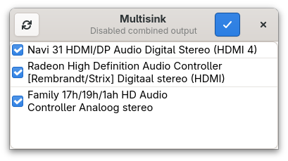
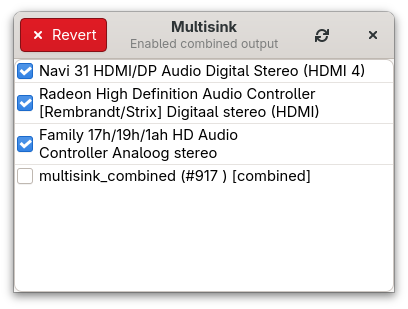

# Multisink

Multisink is a lightweight audio-mirroring tool for Linux.
It lets you send audio to **multiple outputs at the same time** — HDMI, speakers, headphones, USB DACs, whatever you’ve got.

It works on Wayland and X11, supports **PipeWire and PulseAudio**, and comes with both a clean GTK4 GUI and a simple CLI.

## Usage

1. Download the AppImage from the [releases](https://github.com/noobping/multisink/releases/latest) page.
2. Make it executable:

```sh
chmod +x Multisink-*.AppImage
```

3. Run it:

```sh
./Multisink-*.AppImage
```

## Screenshots



List off output devices.



Output devices are combined.

## Development

This section helps you get a development environment up and running.

### VS Code

Configuration for VS Code:

```json
{
    "rust-analyzer.server.path": "/var/home/$USER/.cargo/bin/rust-analyzer",
    "rust-analyzer.runnables.command": "/var/home/$USER/.cargo/bin/cargo",
    "rust-analyzer.files.exclude": [
        ".flatpak"
    ],
    "rust-analyzer.server.extraEnv": {
        "PATH": "/var/home/$USER/.cargo/bin:/app/bin:/usr/bin"
    }
}
```

### Application

1. Install dependencies (inside your toolbox)

```sh
sudo dnf install \
    gtk4-devel gcc clang pkgconf-pkg-config \
    glib2-devel cairo-devel pango-devel libadwaita-devel \
    pactl xkeyboard-config libxkbcommon
curl --proto '=https' --tlsv1.2 -sSf https://sh.rustup.rs | sh
```

2. Build the project (also inside the toolbox)

```sh
cargo build --release
```

### AppImage

1. Add a convenient alias for appimage-builder

```text
alias appimage-builder='podman run --rm -it \
    -v $(pwd):/project:Z \
    -w /project \
    appimagecrafters/appimage-builder:latest appimage-builder --skip-test'
```

This lets you run the AppImage builder without installing anything on the host.

2. Build the AppImage

```sh
appimage-builder --recipe appimage-builder.yml
```

This will generate a standalone .AppImage that bundles all required libraries.
